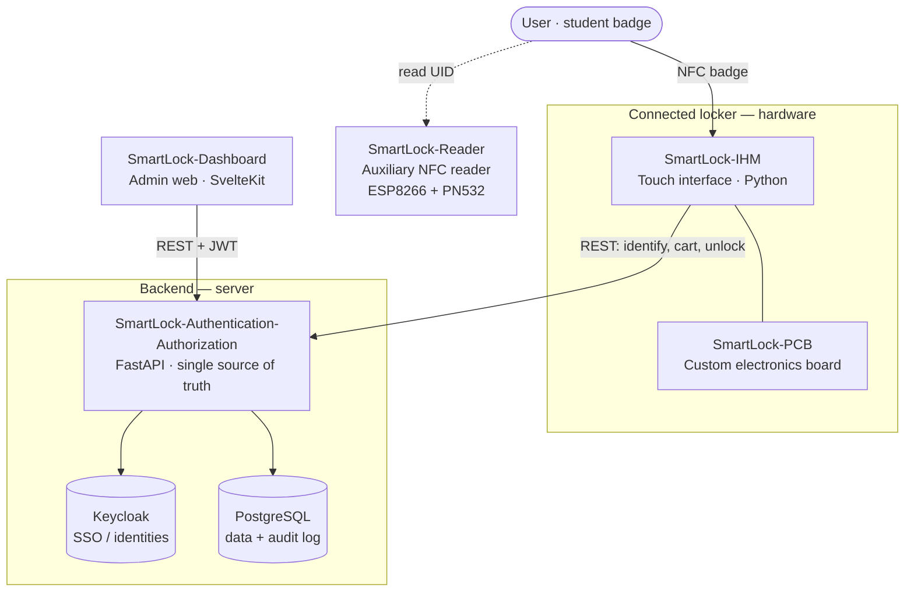

# SmartLock

Hub repository for the **DeVinci Fablab SmartLock** system, a badge-controlled connected-locker (*armoire connectée*) platform for managing self-service hardware and inventory.

> [!NOTE]
> This repository holds **no application code**. It is an **index**: each component lives in its own repository and is vendored here as a git **submodule** under [`submodules/`](./submodules), tracked on its `main` branch. Start here for how the pieces fit together, then open the submodule you need.

## Contents

- [Overview](#overview)
- [System architecture](#system-architecture)
- [Components](#components)
- [Repository layout](#repository-layout)
- [Getting started](#getting-started)
- [Build & deployment](#build--deployment)
- [License](#license)

## Overview

SmartLock controls access to fablab lockers with student NFC badges. Each locker holds an inventory of items (filament, electronic components, supplies). The system handles identification, per-locker permissions, inventory and stock, an append-only audit log, and an admin interface to manage all of it.

It splits into five repositories: the locker **hardware**, a central **backend** that acts as the single source of truth, and an **admin dashboard**.

## System architecture



At runtime the Authentication-Authorization API sits in the middle. The dashboard and the locker interface reach Keycloak and PostgreSQL only through it, never on their own. This diagram shows the intended wiring; see each repo for how far its integration has progressed.

## Components

| Component | Local path | Role | Stack |
|---|---|---|---|
| [**SmartLock-Authentication-Authorization**](https://github.com/DeVinci-FabLab/SmartLock-Authentication-Authorization) | [`submodules/SmartLock-Authentication-Authorization`](./submodules/SmartLock-Authentication-Authorization) | Core backend and single source of truth for identities, roles, permissions and audit. Validates NFC badge scans and exposes the REST API the dashboard and the locker interface call. | FastAPI · Keycloak · PostgreSQL |
| [**SmartLock-Dashboard**](https://github.com/DeVinci-FabLab/SmartLock-Dashboard) | [`submodules/SmartLock-Dashboard`](./submodules/SmartLock-Dashboard) | Internal admin web app for inventory, roles, stock, CSV purchase orders and audit history. A REST client of the auth API, with Keycloak SSO. | SvelteKit · shadcn-svelte |
| [**SmartLock-IHM**](https://github.com/DeVinci-FabLab/SmartLock-IHM) | [`submodules/SmartLock-IHM`](./submodules/SmartLock-IHM) | Touch interface on the locker: badge identification, cart, and unlock, talking to a backend REST API. | Python · CustomTkinter |
| [**SmartLock-Reader**](https://github.com/DeVinci-FabLab/SmartLock-Reader) | [`submodules/SmartLock-Reader`](./submodules/SmartLock-Reader) | Standalone auxiliary NFC reader. Shows scanned badge UIDs on a small web page over its own WiFi access point, with a copy button, useful when you need a card's UID. | ESP8266 + PN532 · Arduino |
| [**SmartLock-PCB**](https://github.com/DeVinci-FabLab/SmartLock-PCB) | [`submodules/SmartLock-PCB`](./submodules/SmartLock-PCB) | Custom electronics board for the locker hardware. | *Placeholder repo for now* |

## Repository layout

```plain
SmartLock/
├── docs/
│   └── DEPLOYMENT.md     Meta build & deployment guide (start here to deploy)
├── submodules/           Each component, tracked on its main branch
│   ├── SmartLock-Authentication-Authorization/
│   ├── SmartLock-Dashboard/
│   ├── SmartLock-IHM/
│   ├── SmartLock-Reader/
│   └── SmartLock-PCB/
├── .gitmodules
├── LICENSE
└── README.md
```

## Getting started

Clone the hub **with all submodules**:

```bash
git clone --recurse-submodules git@github.com:DeVinci-FabLab/SmartLock.git
```

If you cloned without `--recurse-submodules`, initialize them:

```bash
git submodule update --init --recursive
```

Pull the latest `main` of every component:

```bash
git submodule update --remote
```

Then follow each component's own `README.md` inside its directory to build and run it.

## Build & deployment

The end-to-end order, what to fabricate and deploy first and how the pieces come online, lives in **[`docs/DEPLOYMENT.md`](./docs/DEPLOYMENT.md)**. That file is the top-level guide; each component keeps its own detailed deployment docs in its repository.

## License

This project is licensed under the **MIT License**, Copyright (c) 2025 DeVinci Fablab. See [`LICENSE`](./LICENSE) for details. Each submodule carries its own license (MIT as well at the time of writing).
