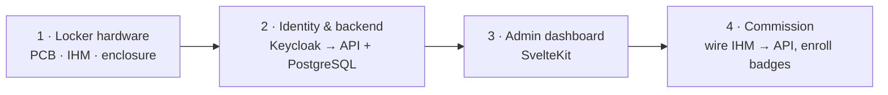

# Build & Deployment Guide

This is the top-level guide for the whole SmartLock system. It gives the **order** in which to fabricate the hardware and deploy the services, and how each piece comes online. Each component keeps its own detailed deployment docs in its repository; this guide tells you what to do first and how it fits together, then points you there.

## Contents

- [Prerequisites](#prerequisites)
- [Build & deployment order](#build--deployment-order)
  - [Phase 1 — Locker hardware](#phase-1--locker-hardware)
  - [Phase 2 — Identity & backend](#phase-2--identity--backend)
  - [Phase 3 — Admin dashboard](#phase-3--admin-dashboard)
  - [Phase 4 — Commission the locker](#phase-4--commission-the-locker)
- [Shared deployment conventions](#shared-deployment-conventions)

## Prerequisites

- A Linux server reachable from the fablab network. The stack is self-hosted, with no cloud serverless.
- **Docker** + **Docker Compose v2** on the server.
- **Traefik** running as the reverse proxy, with an external Docker network (referenced below as `traefik-network`).
- DNS records pointing your domains (`auth.…`, `api.smartlock.…`, `dashboard.smartlock.…`) to the server's public IP.
- `VOLUMES_PATH` defined in the server environment (see [conventions](#docker-volumes)).

> [!NOTE]
> The containerized services (API, Dashboard) follow the shared conventions in the [last section](#shared-deployment-conventions). Read it once; it applies to every service.

## Build & deployment order

Build from the physical layer up: the locker first, then the backend it talks to, then the admin tooling on top.



### Phase 1 — Locker hardware

Fabricate and assemble the physical locker before anything else. The rest of the system has nothing to talk to until a locker exists.

1. **PCB**: fabricate or order the custom electronics board, see [`SmartLock-PCB`](../submodules/SmartLock-PCB).
2. **Enclosure and mechanics**: the locker model, lock actuator and wiring.
3. **IHM**: install the touch interface on the locker and flash it, see [`SmartLock-IHM`](../submodules/SmartLock-IHM). You wire it to the API in Phase 4.
4. **Reader** (optional, auxiliary): flash the standalone NFC reader, see [`SmartLock-Reader`](../submodules/SmartLock-Reader). Use it to read a badge UID when you need one.

At the end of this phase you have a powered locker with a touch screen, not yet connected to any backend.

### Phase 2 — Identity & backend

Deploy the single source of truth next. Order matters inside this phase: **Keycloak first**, then the API and database.

1. **Keycloak**: deploy it, then configure the realm, clients, roles and groups.
2. **API + PostgreSQL**: deploy [`SmartLock-Authentication-Authorization`](../submodules/SmartLock-Authentication-Authorization). Migrations run automatically on container start, and the API needs Keycloak reachable.

That repo holds the detailed steps (SSH commands, env vars, realm setup):

- `docs/deployment.md` for the full server deployment guide
- `docs/keycloak-test-guide.md` for the realm, clients, roles and groups
- `docs/system-design.md` for the architecture, auth flows and data model

Check it: the API answers at `https://api.smartlock.devinci-fablab.fr`, with Swagger UI at `/docs`.

### Phase 3 — Admin dashboard

With the API live, deploy the admin web app, see [`SmartLock-Dashboard`](../submodules/SmartLock-Dashboard).

1. Register a Keycloak client for the dashboard (OIDC + PKCE).
2. Fill `web/.env` (API URL, Keycloak issuer and client, session secret), see the dashboard README.
3. Deploy the hardened production image (`just prod`, `adapter-node`, healthcheck on `/health`).

The dashboard is a REST client of the API; it never talks to Keycloak or PostgreSQL directly.

### Phase 4 — Commission the locker

Tie it all together:

1. Point the **IHM** on the locker at the production API URL.
2. Enroll badges: read UIDs with the Reader (or the IHM) and grant locker permissions in the Dashboard.
3. Run a full pass: badge scan → identification → cart → unlock, then confirm the action lands in the audit log.

---

## Shared deployment conventions

The DeVinci Fablab conventions below apply to every containerized service (API, Dashboard). The per-repo deployment docs refer back to them.

### Docker volumes

Volumes live under a single directory to ease management and backup. The server environment defines the root as `VOLUMES_PATH`.

```yaml
services:
  your-service:
    image: ...
    volumes:
      - ${VOLUMES_PATH}/your_service_name/volume1:/my/volume1
      - ${VOLUMES_PATH}/your_service_name/volume2:/my/volume2
```

> [!NOTE]
> A variable like `VOLUMES_PATH`, not managed by the end user, lets you move the volume root without editing every service's configuration.

### Multi-stage Docker images

Service images use multi-stage builds: a shared `base` stage, then split `dev` and production (`serve`) stages, so one `Dockerfile` builds both and you pick the target. Production stages should:

- `EXPOSE` and bind the app to an explicit `--port` (used by the healthcheck and Traefik).
- copy the source into the image so the container runs standalone, with no bind-mounted volume.
- declare a `HEALTHCHECK` that runs a small `healthcheck.sh`.

A typical healthcheck script tries `wget --spider` (or `curl --fail`) against `http://0.0.0.0:<port>/` and exits non-zero on failure.

### CD pipeline → GHCR

Each service ships a CD workflow under `.github/workflows/`. On every push to `main` it builds the production image and pushes it to the GitHub Container Registry:

```yaml
on:
  push:
    branches: [main]

permissions:
  contents: read
  packages: write
```

Per service you only change the build step's `target` (the production stage) and `tags`, following the format `ghcr.io/devinci-fablab/<service_name>:<tag>`: `<service_name>` lowercase with no spaces, and `<tag>` being `latest` plus the commit SHA.

### Traefik integration

In production, do not publish `ports`; Traefik handles routing. Put the service on the external `traefik-network` and add labels (replace `documentation` with your unique service name, lowercase, no spaces):

```yaml
services:
  your-service:
    image: ghcr.io/devinci-fablab/<service_name>:latest
    restart: unless-stopped
    security_opt:
      - no-new-privileges:true
    deploy:
      mode: replicated
      replicas: 2
    labels:
      - 'traefik.enable=true'
      - 'traefik.http.routers.documentation.rule=Host(`docs.devinci-fablab.fr`)'
      - 'traefik.http.routers.documentation.entrypoints=websecure'
      - 'traefik.http.routers.documentation.tls.certresolver=myresolver'
      - 'traefik.http.services.documentation.loadbalancer.server.port=3000'
      - 'com.centurylinklabs.watchtower.enable=true'
    networks:
      - traefik-network

networks:
  traefik-network:
    external: true
```

- `rule=Host(...)`: the domain that routes to this service; it must point to the server's IP.
- `loadbalancer.server.port`: the port the app listens on inside the container (matches `EXPOSE` and `--port`).
- `deploy.replicas`: run N instances for redundancy and load balancing.

> [!NOTE]
> Publishing container ports can override firewall rules, which is usually not what you want. [Read more](https://www.baeldung.com/linux/docker-container-published-port-ignoring-ufw-rules).

### Watchtower

The `com.centurylinklabs.watchtower.enable=true` label lets **Watchtower** pull and redeploy a service when a new image reaches GHCR, closing the loop with the CD pipeline.
